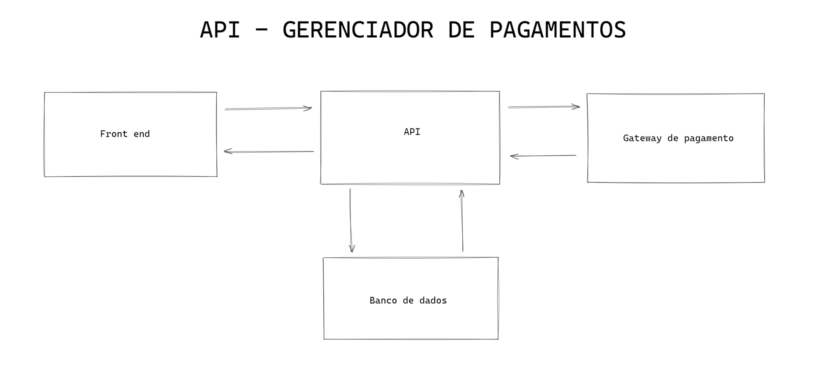
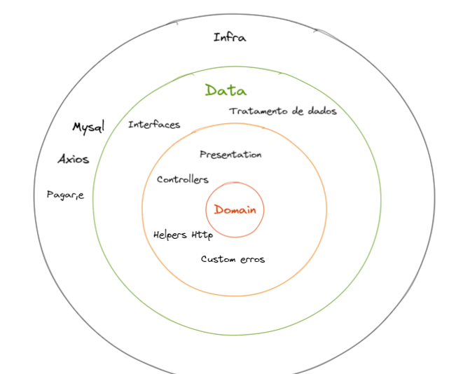

<center>



</center>

<center>


</center>

## Sobre

Este serviço é uma integração com o gateway de pagamentos [Pagar.me](https://pagar.me/), que possibilita a realização de cobranças pontuais ou recorrentes.

## Sumário

- [Funcionalidades](#funcionalidades)

- [Desing Patterns](#desing-patterns)

- [Metodologias](#metodologias)

- [Camadas](#camadas)

  - [Domínio](#domain)

  - [Apresentação](#presentation)

  - [Dados](#data)

  - [Infraestrurura](#infra)

- [Banco de dados](#banco-de-dados)

- [Health check](#health-check)

- [Rotas](#rotas)

  - [Web Hooks](#web-hooks)

- [Regras de negócio](#regras-de-negócio)

  - [Clientes](#clientes)

  - [Cartões](#cartões)

  - [Endereços](#endereços)

  - [Planos](#planos)

  - [Assinaturas](#assinatura)

  - [Cobrança avulsa](#cobrança-avulsa)

  - [Nota fiscal](#nota-fiscal)

- [Rodando a aplicação](#rodando-a-aplicação)

  - [Desenvolvimento](#desenvolvimento)

  - [Produção](#produção)

  - [Docker](#docker)

  - [Configurações](#configurações)

- [Tecnologias](#tecnologias)

- [Autor](#autor)

- [Licença](#licença)

## Funcionalidades

- CRUD de usuários
- CRUD de planos
- CRUD de endereços
- CRUD de Cartões de crédito
- Geraçaõ de ordem de pagamento
- Calculo de valor proporcional por dispositivo

## Desing Patterns

- Factory
- Adapter
- Dependency Injection

## Metodologias

- Clean Architecture
- Conventional Commits
- GitFlow
- Use Cases

## Camadas

Clean arquitecture tem como fundamento a organização das camadas da aplicação com níveis de acesso, por exemplo:

- Infra acessa Data
- Data acessa Presentation
- Presentation acessa Domain.

<center>



</center>

#### **Domain**

Como o próprio nome sugere, a pasta possui arquivos que delimitam as entidades da aplicação, ou seja, estabelecem os requisitos e os casos de uso, como por exemplo: get, put, delete e post.

#### **Presentation**

A camada de apresentação, possui os controllers responsáveis pelas validações das rotas, tem acesso a helpers http e validadores.

#### **Data**

Camada acessada somente com a liberação do presentation, onde de fato manipulamos os dados.

Como por exemplo em um caso de singup, seria onde faríamos o encrypter da senha do usuário.
No caso desta aplicação, foi usada para requisitar o gateway de pagamento e o repositório local.

#### **Infra**

Camada onde fazemos a conexão com as dependências extenas do projeto.

#### **Main**

Esta pasta não está representada na imagem acima, pois se trata da configuração do projeto, dela que é configurado as rotas, factories, server e afins.

## Health check

Esta aplicação está disponível no Heroku como base de testes. Foi criado uma rota de verificação de saúde.

Acesse: <https://back-manager-payments.herokuapp.com/api/health-check>

Retorno esperado:

```
{
 "check": "I'm working fine, on port alguma porta."
}
```

## Banco de dados

Esta API possui a conexão com um banco de dados relacional, no caso foi utilizado o [MySQL](https://www.mysql.com/).

Sempre que é realizado alguma transação junto ao gateway de pagamentos, é coletado o retorno do gateway e salvamos no banco de dados local. Ou seja, existe somente um espelhamento das informações.

## Rotas

#### **Fluxo de uma rota**

Ao solicitar qualquer rota, a api segue o fluxo da seguinte forma:

- 1º Recebe a requisição pelo arquivo de routes dentro de main/routes
- 2ª Repassa a request e response através de um adaptador criado baseado no express
- 3º Passa as informações para um factory
- 4º O factory por sua vez, injeta todas a dependência necessária no controller
- 5º O controller faz as valiações necessárias e chama a camada de dados
- 6º A camada de dados recebe a injeção de dependência do Gatyeway de pagamentos e em algumas vezes o repositório e posteriormente executa as chamadas
- 7º O Gateway de pagamento executa a função e retorna o modelo de retorno definido do Domain
- 8º Caso exista a injeção de dependência de resositório, a cama de dados irá aguardar a ação no banco de dados
- 9ª Em casos de sucesso a resposta volta ao controller e por sua vez repassa ao factory e posteriormente ao response da rota chamada

Todas as rotas da aplicação, com exceção dos devices foram baseadas na mesma syntax disponibilizada pela [Pagar.me V5](https://docs.pagar.me/docs). Segue a documentação:

- Customers: <https://docs.pagar.me/reference/clientes-1>

- Cartões: <https://docs.pagar.me/reference/cart%C3%B5es-1>

- Endereços: <https://docs.pagar.me/reference/endere%C3%A7os>

- Pedidos: <https://docs.pagar.me/reference/pedidos-1>

- Planos: <https://docs.pagar.me/reference/planos-1>

- Assinaturas: <https://docs.pagar.me/reference/assinaturas-1>

## Devices

Foi criado um CRUD de devices que serve para cadastro do valor do dispositivo que cada plano terá.

O Objeto device possui as seguintes interfaces:

```
export interface Device {
 name: string
 full_price: number
}

export interface DeviceModel extends Device {
 id: number
 proportional_value: number
}

```

Casos de uso:

```
export interface AddDeviceUseCase {
 add(device: Device): Promise<DeviceModel>
}

export interface GetDeviceUseCase {
 get(id: number): Promise<DeviceModel>
}

export interface UpdateDeviceUseCase {
 update(device: Device, device_id: number): Promise<DeviceModel>
}

export interface ListDevicesUseCase {
 list(): Promise<DeviceModel[]>
}

export interface DeleteDeviceUseCase {
 delete(id: number): Promise<DeviceModel>
}

export interface GetDeviceProportionalValueUseCase {
 get(id: number): Promise<DeviceModel>
}
```

- GET /devices
- POST /devices
- PUT /devices/:id
- DELETE /devices/:id
- GET /devices/:id/proportional
- POST /devices/single-charge

A rota /devices/:id/proportional retorna o valor proporcional de um device relativo ao dia do mês. O cálculo é feito da seguinte forma:

```
const valuePerDay = full_price / this.dateUtils.daysInMonth()

const daysToEndOfMonth = this.dateUtils.daysToEndOfMonth()

const proportionalValue = valuePerDay * daysToEndOfMonth

return proportionalValue
```

Portanto, o valor é atualizado diariamente.

#### **Web Hooks**

O Gateway de pagamentos fornece opção de integração de eventos através dos web hooks, desta forma, utilizamos alguns dos eventos para seguintes rotinas:

- Geração de pedido (ordem de pagamento)

```
/devices/single-charge
```

- Emissão de nota fiscal

```
Ainda não foi implementado
```

## Regras de negócio

De modo geral, as regras são basicamente para evitar repetições de registro, ou seja, não se pode existir mais de um registro do mesmo cliente.

Um cliente não pode ter mais de um endereço, cartão e assinatura.

#### **Clientes**

Antes de qualquer transação, é obrigatório o cadastro do cliente. Possui informações básicas no contexto de entidade, e informação de endereço.

#### **Cartões**

Informações padrão de um cartão de crédito, como por exemplo: nome, número, vencimento e cvv. O Endereço de cobrança é o mesmo utilizado no cadastro do cliente.

#### **Endereços**

Informações comum sobre endereço.

#### **Planos**

O plano é a base da cobrança de qualquer assinatura. O usuário escolhe o plano contratado.

#### **Assinatura**

A assinatura nada mais é do que a cobrança recorrente de um plano.

#### **Cobrança avulsa**

As cobranças avulsas são feitas quando o usuário adiciona um dispositivo (device), na assinatura.

Desta forma, a cobrança é feita proporcional em relação a quantidade de dispositivos e ao dia da contratação.

Após a contratação de dispositivos extras, a assinatura é atualizada, e na próxima cobrança, será cobrado o valor integral.

#### **Nota fiscal**

Ainda não implementado.

## Rodando a aplicação

#### **Instale as dependências**

```
yarn
```

#### **Configure as envs**

crie um arquivo `.env` na raiz e adicione:

```
PORT=
PAGARME_SECRET_KEY=
PAGARME_PUBLIC_KEY=
PAGARME_ENDPOINT=
DB_HOST=
DB_USER=
DB_PASSWORD=
DB_PORT=
DB_DATABASE=
DB_TIMEZONE=
```

#### **Desenvolvimento**

Ativação do [Huky](https://www.npmjs.com/package/husky)

```
yarn preapre
```

```
yarn dev
```

#### **Produção**

```
yarn build
```

```
yarn start
```

#### **Docker**

```
docker build -t back-manager-payments .
```

```
docker run -p 4000:4000 back-manager-payments
```

Obs: O Docker não está configurando para subir um container com o banco de dados.

#### **Configurações**

Devido a utilização de web hooks, é necessário que seja configurado as rotas pelo painel da [Pagar.me](https://pagar.me/).

Acesse o dashboard e siga os passos a seguir:

1. Configurações;
2. Web Hooks;
3. Criar webhook;
4. Informe a URL (Não pode ser localhost, no caso desta aplicação: https://URL/devices/single-charge);
5. Adicione o evento de **Item de assinatura**, subscription_item.created;
6. Salve

## Tecnologias

- Axios 1.1.3
- Dotenv 16.0.3
- Express 4.18.2
- Moment 2.29.4
- MySQL 2.18.1

## Autor

Guilherme de Carvalho Boaventura

Desenvolvedor full-stack

<guilherme.boaventura@involucro.com.br>

https://involucro.com.br

## Licença

MIT
